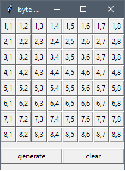
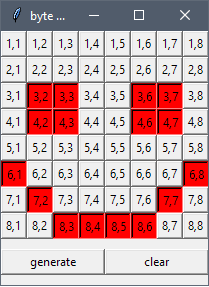
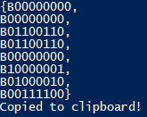

# LED_byte_matrix_generator
Graphical interface for generating byte array for 8x8 matrix for use with LedControl.h library

Run the script to see GUI:

Click buttons to set them to on. Click again to turn off

Draw something:

Click the generate button to generate byte array corresponding to the drawing. The array should be automatically copied to your clipboard

Click clear to clear the matrix and make another drawing
